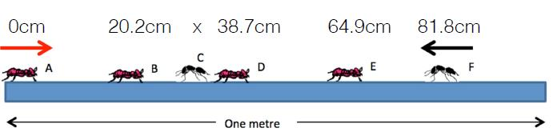

## Introduction
{}\

Ants walk at 1cm/second. When they meet, each ant turns around and walks in the other direction. When they reach the end of the stick they fall off.

(1) How many seconds until the last ant falls off?

(2) Which ant is the last to fall off the stick?

## Solution
Creat three vector:

(1) Flag: represent the label of each ant;

(2) Speed: represent the speed of each ant in the flag vector;

(3) Location: represent the location of each ant in the flag vector from the 0 point on the stick;

Examine the location of each ant each second. Since ants which go to left only meet the ant on the left of it, when the location of ants which goes to left is smaller than that of the ant on the left of it, their location and speed will be changed.

Here is the code:

```{r}
set.seed(789)
Time <- numeric()
Last <- vector()
ant <- function(n){
  for (l in 1:n){
    location <- c(0, 20.2, runif(1,20.2,38.7), 38.7, 64.9, 81.8) #define location of each ant
    flag <- c('a','b','c','d','e','f') #define label of each ant
    speed <- c(1,1,-1,1,1,-1) #define initial speed of eahc ant
    T <- 0
    while(length(location)>1){ # Examine if there is only one ant on the stick
      T <- T+1 # Time flows one second
      # The location of each ant changes
      for (i in 1:length(location)){
        location[i] <- location[i] + speed[i]
      }
      
      left <- which(speed < 0) # Find the ants go to left side
      # If the ant is not the most left side ant, compare its location with the ant on the left 
      # of it. And if its location is lower the ant on the left of it, change their speed and location.
      if(left[1] > 1){
        for (j in 1:length(left)){
          if (location[left[j]] < location[left[j]-1]){
            tmp1 <- speed[left[j]]  
            speed[left[j]] <- speed[left[j]-1]
            speed[left[j]-1] <- tmp1
            tmp2 <- location[left[j]]  
            location[left[j]] <- location[left[j]-1]
            location[left[j]-1] <- tmp2
          }
        }
      } 
      # Examine if there's ant fall off from the stick. If there is one, remove its label, location and speed.
      k <- 1
      while (k <= length(location)){
        if ((speed[k] < 0 & location[k] < 0) | (speed[k] > 0 & location[k] > 100)){
          location <- location[-k]
          flag <- flag[-k]
          speed <- speed[-k]
        }
        else{
        k <- k+1
        }
      }
    }
  T <- T + 100 - location #Total time equals to the sum of time flowed from the very beginning and the time the last ant on 
                          #the stick will use to fall off from the stick
  Time[l] <- T
  Last[l] <- flag
  }
  cat('\nIt will be', mean(Time) ,'seconds until last ant falls off.')
  cat('\nFot the last trial,',flag,'is the last ant to fall off.')
  as.data.frame(table(Last))
}
ant(1)
```

If we repeat the situation for 100 times.
```{r}
ant(100)
```

In such case, we can know that it will be always 100 seconds until last ant falls off from the stick and the last ant will always be No.C.
