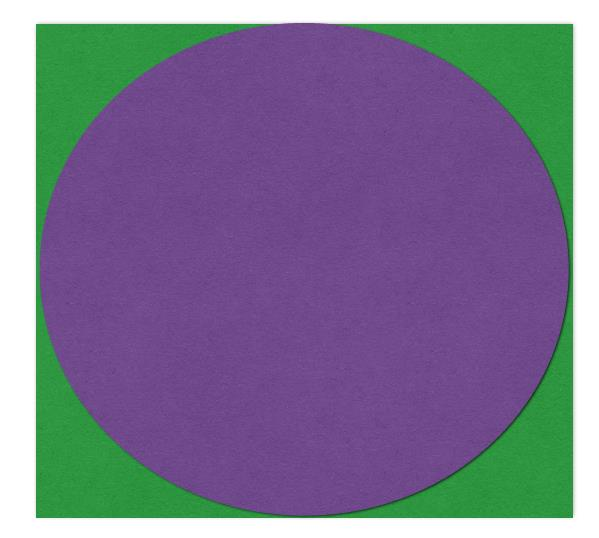
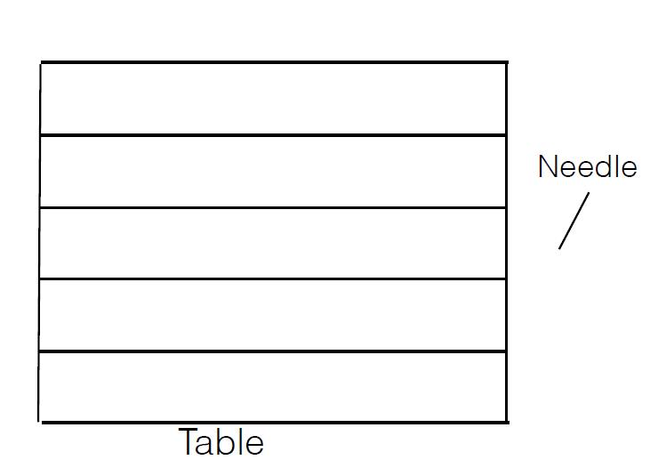

## Question

Estimate $\pi$ using Monte Carlo Methods

## Solution 1
{width=50%} \

According to the picture, we can randomly choose points from the square with area of 1and see how many points will be in the circle within the square.

$$p = \frac{\pi}{4}$$

In such case, we will have code like this:
```{r}
set.seed(676)
n<-10000
count<-0
for (i in 1:n){
  point<-runif(2,-1,1)
  if (point[1]**2+point[2]**2 <= 1){
    count<-count+1
  }
}
spi<-count*4/n
cat("\nOur estimate of the expected pi is ",spi)
```

## Solution 2: Buffon's needles
{width=50%} \
Suppose we have a floor made of parallel strips of wood, each the same width, and we drop a needle onto the floor. What is the probability that the needle will lie across a line between two strips?

Suppose the length of needle is $l$, the distances between two strips is $t$.

Let $x$ be the distance from the center of the needle to the closest line, and let $\theta$ be the acute angle between the needle and the projected line with length $x$.

The uniform probability density function of $x$ between $\theta$ and $\frac{t}{2}$ is:

$$\left\{  
             \begin{array}{ll}  
             \dfrac{2}{t} : 0 \le x \le \dfrac{t}{2}\\  
             0: elsewhere
             \end{array}  
\right. $$

The uniform probability density function of $\theta$ between 0 and $\frac{\pi}{2}$ is:

$$\left\{
            \begin{array}{ll}
            \dfrac{2}{\pi}: 0 \le \theta \le \dfrac{\pi}{2}\\
            0:elsewhere
            \end{array}
\right.$$

In such case, the joint probability density function is the product of these two probability density function:

$$\left\{
            \begin{array}{ll}
            \dfrac{4}{t \pi}: 0 \le x \le \dfrac{t}{2}; 0 \le \theta \le \dfrac{\pi}{2}\\
            0:elsewhere
            \end{array}
\right.$$

The needls crosses a line if:

$$x \le \frac{l}{2} cos\theta$$

In such case, we have two rules:

(1) We can set an area with width $t$, and randomly select points in this area.

(2) The probability is not related to horizontal coordinate of the point.

Here we will have two situations:

### Situation 1: Short needle

if $l < t$:

$$p = \int_{\theta = 0}^\frac{\pi}{2} \int_{x = 0}^{\frac{l}{2}cos\theta} \frac{4}{t \pi} dx d\theta = \frac{2l}{t \pi}$$

In such case, we will have $\pi$ like this:

$$\pi = \frac{2l}{tp}$$

In this situation, we will have code like this:

```{r}
set.seed(676)
l <- 0.5
t <- 1
cross <- numeric() # whether the needle cross the line or not
numberofneedles <- 1000000

for (i in 1:numberofneedles){
  x <- runif(1,0,t) # The vertical coordinate of the point
  theta <- runif(1,0,pi/2)
  if (x <= l/2 * cos(theta) | t-x <= l/2 * cos(theta)){
    cross[i] = 1
  }
  else{
    cross[i] = 0
  }
}

cat("\nThe probability of a needle cross the line is", sum(cross)/numberofneedles)

spi2 <- 2*l/(t * sum(cross) / numberofneedles)

cat("\nOur estimate of the expected pi is", spi2)
```

### Situation 2: Long needle

if $l < t$:
$$ \begin{split}
&When \frac l2cos(\theta) = \frac t2, \\
&\theta = arccos(\frac tl)
\end{split}$$
$$ \begin{split}
p &= \int_{\theta = 0}^\frac{\pi}{2} \int_{x = 0}^{min(\theta)} \frac{4}{t \pi} dx d\theta\ where\ min(\theta) = min(\frac t2, \frac{l}{2}cos(\theta))\\
&= \int_{\theta = 0}^{arccos(\frac tl)} \int_{x = 0}^{\frac t2} \frac{4}{t \pi} dx d\theta\ +\ \int_{\theta = arccos(\frac tl)}^{\frac{\pi}{2}} \int_{x=0}^{\frac l2 cos(\theta)} \frac{4}{t \pi} dxd \theta \\
&= \frac{2}{\pi} arccos(\frac tl)\ +\ \frac{2l}{\pi t}(1\ -\ \sqrt{1\ -\ \frac{t^2}{l^2}}) \\
\pi &= \frac 2p arccos(\frac tl) + \frac {2l}{tp} (1\ -\ \sqrt{1\ -\ \frac{t^2}{l^2}})
\end{split}$$

In such case, we will have code like this:

```{r}
set.seed(676)
l <- 2
t <- 1
cross <- numeric() # whether the needle cross the line or not
numberofneedles <- 1000000

for (i in 1:numberofneedles){
  x <- runif(1,0,t) # The vertical coordinate of the point
  theta <- runif(1,0,pi/2)
  if (x <= l/2 * cos(theta) | t-x < l/2 * cos(theta)){
    cross[i] = 1
  }
  else{
    cross[i] = 0
  }
}

p <- sum(cross)/numberofneedles

cat("\nThe probability of a needle cross the line is", p)

spi3 <- 2 / p * acos(t/l) + 2*l / (t * p) * (1 - sqrt(1 - t^2 / l^2))

cat("\nOur estimate of the expected pi is", spi3)
```

It seems that using longer needles will get the better estimation. But I don't know if the assumption is true and how to prove it.
